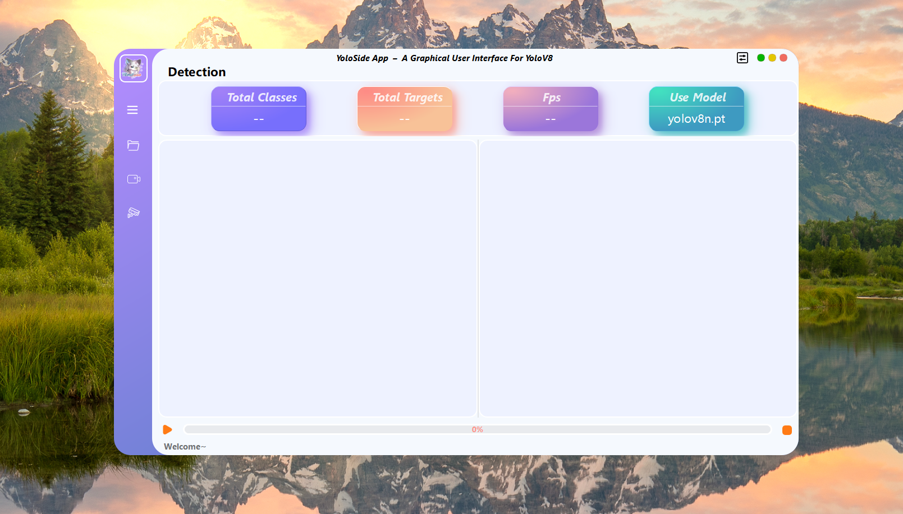

# YoloSide ~ A GUI For YoloV8 `V2.0`
---

## How to Run
- `python>=3.8`
- `pip install ultralytics==8.0.48`
- `pip install pyside6==6.4.2`
- `python main.py`

#### !!The corresponding version of the library must be installed
#### !!Otherwise, the following error will appear:`not enough values to unpack (expected 5, got 4)`

## Notice
- `ultralytics` follows the `GPL-3.0`, if you need commercial use, you need to obtain its license.
- If you expect to use your own model, you need to use `ultralytics` to train the yolov8/5 model first, and then put the trained `.pt` file into the `models` folder.
- There are still some bugs in the software, and I will continue to optimize and add some more interesting functions as my time allows.
- If you check the save results, they will be saved in the `./run` path
- The UI design file is `home.ui`, if you modify it, you need to use the `pyside6-uic home.ui > ui/home.py` command to regenerate the `.py` file
- The resource file is `resources.qrc`, if you modify the default icon, you need to use the `pyside6-rcc resoures.qrc > ui/resources_rc.py` command to regenerate the `.py` file

## Video
- [BiliBili~YoloSide V2.0](https://www.bilibili.com/video/BV1Cb411f7cw/?spm_id_from=333.999.0.0)
- [Youtube~YoloSide V2.0](https://www.youtube.com/watch?v=auJLVrt7ImQ)

## To Do

- [ ] The input source supports camera and RTSP (if you need this function urgently, you can modify it according to the `chosen_cam`、`chose_rtsp`、`load_rtsp` function in `mian.py`)
- [ ] Graph showing changes in target quantity
- [ ] Target tracking
- [ ] Instance segmentation
- [ ] Monitor system hardware usage

## References
- [PyQt5-YOLOv5](https://github.com/Javacr/PyQt5-YOLOv5)
- [ultralytics](https://github.com/ultralytics/ultralytics)
